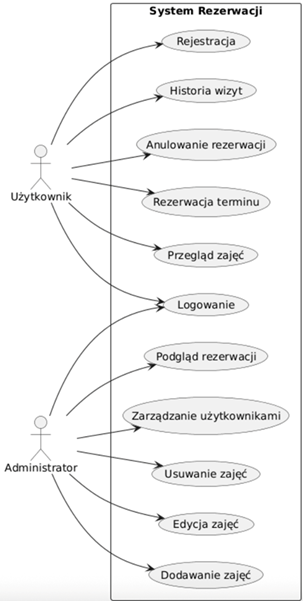

# ReadySetGo
Aplikacja - System Rezerwacji Usług Sportowych

> *TBD*

*TBD*

**Odznaki**:


---

## Wizja Projektu

### **Problem:**

Małe studia fitness i trenerzy tracą czas na ręczne odpisywanie na wiadomości i telefony w sprawie zapisów. Klienci rezygnują z usług, gdy nie mogą sprawdzić dostępności terminu "tu i teraz" (np. późno wieczorem), co powoduje:

* próba 
* brak kontroli nad liczbą miejsc,
* błędy w zapisach,
* trudności w zarządzaniu grafikiem,
* brak historii rezerwacji

### **Użytkownik:**

**_Klient:_** 	Osoba aktywna, ceniąca czas, chcąca zarezerwować trening w 3 kliknięcia.

**_Administrator/Trener:_** Profesjonalista potrzebujący czystego wglądu w grafik i 		automatyzacji powiadomień.

### **Wartość biznesowa:**

* Automatyzacja zapisów
* Oszczędność czasu
* Lepsza organizacja pracy
* Możliwość dalszej rozbudowy (np. płatności online)

### **Diagram przykładu użycia:**



---

## System rezerwacji usług sportowo rekreacyjnych

| Funkcjonalności           | Opis                                                 |
|---------------------------|------------------------------------------------------|
| **Autentykacja**          | Rejestracja i logowanie                              |
| **Przegląd Zajęć**        | Przeglądaj dostępne zajęcia                          |
| **Rezerwacja terminów**   | Rezerwój terminy zajęć                               |
| **Anulowanie**            | Anuluj swoje rezerwacje                              |
| **Panel administratora**  | Panel Administratora posiadający dostęp do strony    |

---


## Roadmap

**W Jira**

---

## MVP

**Minimalna wersja systemu obejmuje:**
- Konto użytkownika
- Rezerwację zajęć
- Połączenie z bazą danych
- Podstawowy panel admina

---

## Klasy dla branchy

**Sposób tworzenia brancha:**

`prefix`/`{Opis problemu}`

| Prefix       | Opis                                                                       |
|--------------|----------------------------------------------------------------------------|
| **feat**     | Nowa funkcjonalność (np. dodanie rezerwacji).                              |
| **fix**      | Naprawa błędu.                                                             |
| **docs**     | Zmiany w dokumentacji (readme, javadoc).                                   |
| **style**    | Zmiany formatowania, brakujące średniki, itd. (nie wpływa na logikę kodu). |
| **refactor** | Zmiana kodu, która ani nie naprawia błędu, ani nie dodaje funkcji.                                                                          |
| **chore**    | Zmiany w procesie budowania, narzędziach pomocniczych.                       |


---

## Styl dla PR'ów

| Typ        | Subtype           | Issue          | Podsumowanie      |
|------------|-------------------|----------------|-------------------|
| **Prefix** | **Prefix**,**Prefix** | *Issue z Jiry* | *Krótki opis*     |

**Przykład:**

| Typ      | Subtype | Issue     | Podsumowanie                             |
|----------|---------|-----------|------------------------------------------|
| **Docs** |         | **RSG-6** | Zmiana dokumentacji, dodano nowy wygląd. |

---

## Architektura

#### Architektura w skrócie

```
Android App (frontend)
       ↕ HTTP/REST
Ktor Server (backend)
       ↕ JDBC + HikariCP
PostgreSQL (database)
```

#### Struktura docelowa typu *MVVM* dla plików projektu:

```
ReadySetGo/
├── backend/          # Ktor REST API + JDBC + PostgreSQL
│   ├── docker/       # Docker Compose + database setup
│   │   ├── docker-compose.yml  # PostgreSQL 16 container
│   │   ├── start-db.ps1        # Start database
│   │   └── stop-db.ps1         # Stop database       
│   ├── src/
│   │   └── main/
│   │       ├── kotlin/com/ReadySetGo/backend/
│   │       │   ├── config/       # DB config, HikariCP connection pool
│   │       │   ├── controller/   # REST endpoints
│   │       │   ├── repository/   # JDBC queries
│   │       │   ├── model/        # Domain models
│   │       │   └── service/      # Business logic
│   │       └── resources/
│   │           ├── application.conf
│   │           └── logback.xml
│   └── build.gradle.kts
│
├── frontend/         # Android app (MVVM + Hilt + Retrofit)
│   ├── app/
│   │   └── src/main/
│   │       ├── kotlin/com/ReadySetGo/frontend/
│   │       │   ├── data/
│   │       │   │   ├── remote/       # Retrofit API interfaces
│   │       │   │   ├── repository/   # Repository pattern (bridge VM ↔ API)
│   │       │   │   └── model/        # DTOs / UI models
│   │       │   ├── ui/           # (Przykłady UI)
│   │       │   │   ├── home/         # HomeFragment + HomeViewModel
│   │       │   │   └── detail/       # DetailFragment + DetailViewModel
│   │       │   ├── di/               # Hilt modules
│   │       │   └── utils/            # Extensions, constants
│   │       └── res/
│   │           ├── layout/
│   │           ├── navigation/
│   │           └── values/
│   └── build.gradle.kts
│
├── shared/           # Shared DTOs between backend and frontend
│   └── src/main/kotlin/com/ReadySetGo/shared/dto/
│
├── .env.example      # Template dla zmiennych środowiskowych
├── .gitignore
├── d1.png            # Diagram przykładu użycia
└── README.md
```

---

## PostgreSQL Struktura danych

```
TBD
```

---

## Tech Stack

### Narzędzia
| Narzędzie          | Zastosowanie                                   |
|--------------------|------------------------------------------------|
| **IntelliJ IDEA**  | Backend development                            |
| **Android Studio** | Frontend development                           |
| **Docker Desktop** | Startowanie bazy PostgreSQL lokalnie           |
| **GitHub**         | Główne repozytorium projektu / kontrola wersji |
| **Jira**           | Organizacja pracy zespołu                      |

Otwórz oba IDEs obok siebie — IntelliJ dla `backend/`, Android Studio dla `frontend/`.

### Technologie

| Warstwa       | Technologia                       |
|---------------|-----------------------------------|
| Backend       | **Ktor 2.x (Netty)**              |
| DB Bridge     | **JDBC** + **HikariCP**           |
| Database      | **PostgreSQL 16 (Docker)**        |
| Android UI    | **Fragments** + **ViewBinding**   |
| Architecture  | **MVVM** + **Repository pattern** |
| DI            | **Hilt**                          |
| HTTP Client   | **Retrofit 2** + **OkHttp**       |
| Async         | **Coroutines** + **StateFlow**    |
| Repository    | **GitHub**                        |
| Workflow      | **Jira**                          |
| DB Encryption | **JWT** + **BCrypt**              |

---

## Używanie aplikacji

### Wymagania

- [Docker Desktop](https://www.docker.com/products/docker-desktop)
- [Android Studio](https://developer.android.com/studio) — frontend
- [IntelliJ IDEA Community](https://www.jetbrains.com/idea/) — backend
- JDK 17+

### 1. Sklonuj repozytorium

```powershell
git clone https://github.com/szajam/ReadySetGo.git
cd ReadySetGo
```

### 2. Skopiuj zmienne środowiskowe
```powershell
copy .env.example .env
```
Wypełnij swoje wartości zmiennych w `.env`.

### 3. Wystartuj baze danych
```powershell
cd backend/docker
.\start-db.ps1
```

#### Dla zatrzymania bazy danych odpowiednio:
```powershell
cd backend/docker
.\stop-db.ps1
```

### 4. Wystartuj backend
```powershell
cd backend
.\gradlew.bat run
```

### 5. Sprawdź czy backend działa
```powershell
curl.exe http://localhost:8080/health
# {"status":"ok","database":"connected"}
```

### 6. Wystartuj aplikacje Android
1. Otwórz w Android Studio: **File → Open** → select `ReadySetGo/frontend`
2. Poczekaj na Gradle sync
3. Połącz się do urządzenia lub wystartuj emulator.
4. Kliknij **Run ▶️** lub naciśnij `Shift+F10`
   
Aplikacja łączy się do `http://10.0.2.2:8080` co przekierowuje ją na lokalny backend.

---

## Zmienne środowiskowe .env

W `.env.example` zawarte są wszystkie wymagane zmienne środowiskowe. 

**Nigdy nie dodawaj do commit'a `.env`!**

| Zmienna            | Domyślna wartość | Opis                   |
|--------------------|------------------|------------------------|
| DB_HOST            | localhost        | PostgreSQL host        |
| DB_PORT            | 5432             | PostgreSQL port        |
| DB_NAME            | db_name          | Nazwa bazy danych      |
| DB_USER            | db_user          | Użytkownik bazy danych |
| DB_PASSWORD        | db_password      | Hasło bazy danych      |
| KTOR_PORT          | 8080             | Backend server port    |
| JWT_SECRET         | abcd1234         | Sekret JWT             |
| JWT_ISSUER         | rsg_issuer       | Nazwa issuer'a JWT     |
| JWT_AUDIENCE       | rsg_users        | Nazwa audiencji JWT    |
| JWT_EXPIRATION_MS  | 86400000         | Czas wygaśnięcia JWT   |

---

## Docker

Baza danych jest zarządzana poprzez Docker Compose. 
Używaj podanych skryptów zamiast surowych komend `docker compose`.
One automatycznie ustawiają ścieżkę do pliku `.env`.

| Skrypt                        | Działanie                      |
|-------------------------------|--------------------------------|
| `backend/docker/start-db.ps1` | Wystartuj kontener PostgreSQL  |
| `backend/docker/stop-db.ps1`  | Zatrzymaj kontener PostgreSQL  |

---

## API

| Metoda | Endpoint       | Opis                     |
|--------|----------------|--------------------------|
| GET    | /health        | Server + database status |
| POST   | /auth/register | Rejestracja użytkownika  |
| POST   | /auth/login    | Logowanie użytkownika    |

Więcej endpoint'ów się pojawi w ciagu projektu.

---

## Paleta kolorów

| Token | Kolor | Zastosowanie |
|-------|-------|--------------|
| *TBD* | *TBD* | *TBD*        |


---